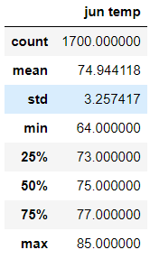
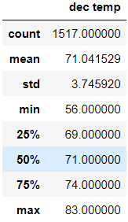
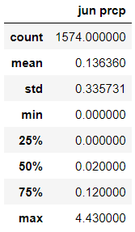
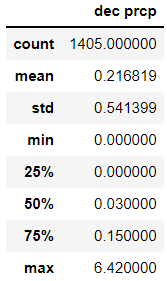

# surfs_up

## Overview
### Purpose
The purpose of this analysis was to find the differences in temperature between June and December for a surf shop in Oahu.

## Results

1. Average temperature is very similar between June and December (74.9F vs 71.0F).
2. The lowest June temperature is only 64F while Decembers lowest was 56F.  56F would be uncomfortable to surf in without a wetsuit.
3. The highest recoreded temperatures for both months are also very similar (June: 85F and December: 83F). This means there isn't much risk of it being too hot to surf.

## Summary
Overall the difference in temperature between June and December is negligible. Oahu has about as stable a climate pattern as you would see anywhere in the world.  This makes it a perfect location to start a year round surf school.

### Further Analysis
Further analysis using the provided data could look into the differences in precipitation between June and December.

Looking into the difference in swell height between June and December would probably be the most helpful.

